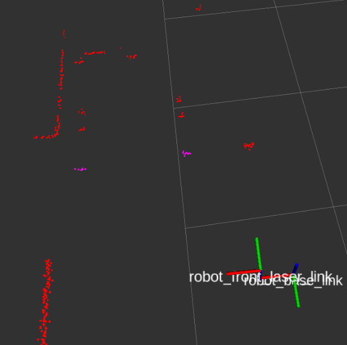
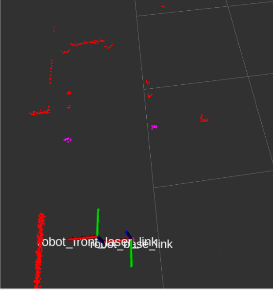
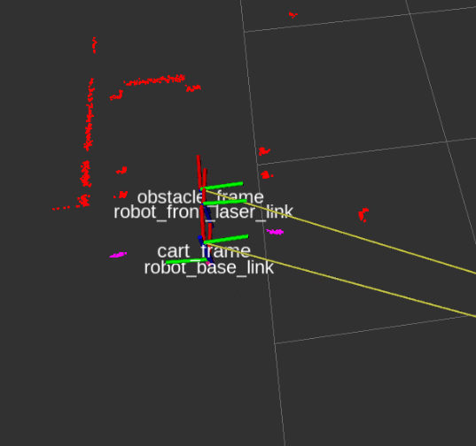
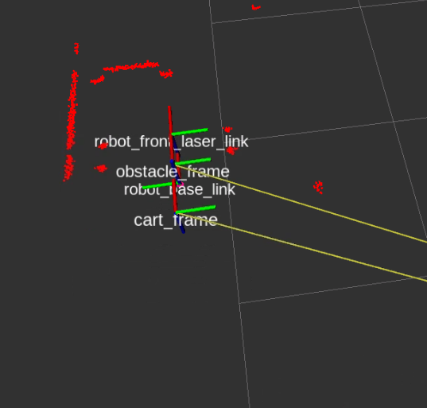
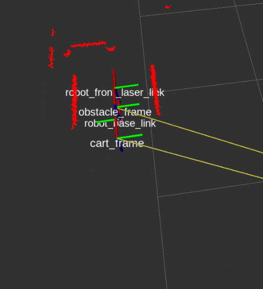

# checkpoint9

## Task1 Preapproach

For this first task, you will create a ROS2 node that makes the robot go to the loading position (facing the shelf).

For achieving this, follow the next steps:

- Create a package inside /ros2_ws named attach_shelf.
- Create a node pre_approach.cpp that subscribes to the /scan topic and publishes to /robot/cmd_vel:
- The node starts publishing a linear velocity to the /robot/cmd_vel topic in order to move the robot forward.
- When the laser detects the obstacle (the wall) x m in front of the robot, stop the robot. Then, the robot will start a rotation of x degrees.

Your node will use the following parameters:

- obstacle: Distance (in meters) to the obstacle at which the robot will stop.
- degrees: Number of degrees for the rotation of the robot after stopping.

How to run for Task1
-- Terminal1
source ~/simulation_ws/devel/setup.bash
roslaunch rb1_base_gazebo warehouse_rb1_laser_detect_legs.launch
-- Terminal2
source ~/catkin_ws/devel/setup.bash
roslaunch load_params load_params_base.launch
source /opt/ros/galactic/setup.bash
ros2 run ros1_bridge parameter_bridge
-- Terminal3
ros2 launch attach_shelf pre_approach.launch.xml obstacle:=0.3 degrees:=-90

My Result

## Task 2   Final Approach 
In this 2nd Task of the project, you will create a ROS2 service that performs the final approach motion. This is:

- It detects the exact position of the shelf.
- It commands the robot right beneath the shelf.
- It attaches the robot to the shelf.

To achieve this, follow the next steps:
- Create a new program named pre_approach_v2.cpp inside the attach_shelf package. In this program paste the code created for Task 1 pre_approach.cpp.
- Create a service server node approach_service_server.cpp that, when called, will start the final approach behavior.
- The service will be named /approach_shelf.
- The service will do the following:
- It will detect the legs of the shelf using the laser intensity values (check Laser Intensities section)
- If the laser only detects 1 shelf leg or none, it will return a False message.
- If it detects both legs, the service will publish a transform named cart_frame to the center point between both legs.
- Then, the robot will use this TF to move towards the shelf (using the transform coordinates).
- Once the robot has reached the TF coordinates, it will move forward 30 cm more (to end up right underneath the shelf).
- Don't forget to lift the shelf at the end of the program (when the robot is underneath). Check Load the shelf section to see how to do it.

How to run for Task2
-- Terminal1
source ~/simulation_ws/devel/setup.bash
roslaunch rb1_base_gazebo warehouse_rb1_laser_detect_legs.launch
-- Terminal2
source ~/catkin_ws/devel/setup.bash
roslaunch load_params load_params_base.launch
source /opt/ros/galactic/setup.bash
ros2 run ros1_bridge parameter_bridge
-- Terminal3
cd ros2_ws/src/checkpoint9
rviz2 -d rviz_tf.rviz
-- Terminal4
ros2 launch attach_shelf attach_to_shelf.launch.py obstacle:=0.3 degrees:=-90 final_approach:=false
or
ros2 launch attach_shelf attach_to_shelf.launch.py obstacle:=0.3 degrees:=-90 final_approach:=true

My Result
- final_approach:=false. Expect to return service_failure, but the TF to cart_frame established between cart's two legs.
   - TF published
   - Service Return service_failure
[approach_service_server_node-2] [INFO] [1717557180.881785738] [mid_legs_tf_service_node]: Laser Callback End, state is service_completed_failure
[approach_service_server_node-2] [INFO] [1717557180.916042273] [mid_legs_tf_service_node]: service_completed_failure

- final_approach:=true

Service completion.
[approach_service_server_node-2] [INFO] [1717556913.181931615] [mid_legs_tf_service_node]: Laser Callback End, state is service_completed_success
[approach_service_server_node-2] [INFO] [1717556913.188518373] [mid_legs_tf_service_node]: Laser Callback End, state is service_completed_success
[approach_service_server_node-2] [INFO] [1717556913.229749405] [mid_legs_tf_service_node]: Laser Callback End, state is service_completed_success
[approach_service_server_node-2] [INFO] [1717556913.241007425] [mid_legs_tf_service_node]: service_completed_success
